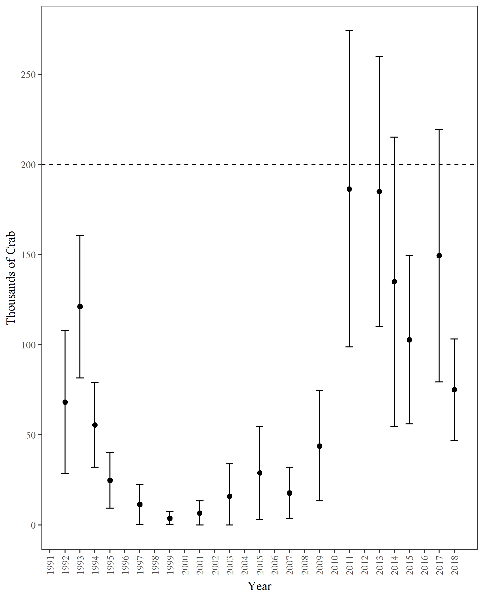

```{r, echo=FALSE, message=FALSE, warning=F}
library(knitr)
library(xtable)
library(tidyverse)
library(kableExtra)
options(scipen=9999) # remove scientific notation
knitr::opts_chunk$set(echo = FALSE, message=F, warning=F)
```

The 2017 Prince William Sound large-mesh bottom trawl survey was conducted between June 9th and 16th.  A total of 48 successful 1 nmi tows were completed, including 5 in Valdez Arm (Figure 1).  A total of 1,350 male and 1,040 female Tanner crab were captured.

Although the legal size was reduced from 135 mm (5.3 in) to 127 mm (5.0 in) in 2017, the historical legal size of 135 mm was retained for achieving minimum stock size thresholds and setting total allowable catch (5 AAC 35.308).  Catch can be retained so long as it is larger than the legal size (127 mm).  The abundance threshold for opening the commercial fishery is 200,000 males larger than the historical legal size.

The 2017 catch included 189 historical legal males.  Mean historical legal male CPUE was 3.94 crab/nmi (SE = 0.92; CV = 152%) and ranged from 0 to 20.  The estimated abundance of historical legal males was 149,481 crabs (95% CI = +/- 70,117), slightly greater than the previous 2 surveys in 2014 and 2015, but less than the 2 high years in 2011 and 2013 (Table 1, Figure 2).  The estimated abundance of prerecruit-1 males (113-134 mm) was the second greatest in the history of the survey.  This dominant cohort first appeared in the survey as a record abundance of pre-4’s in 2013, and is anticipated to contribute to an increased abundance of historical legal males in 2018.
      
\listoftables
\listoffigures


\hfill\break
\hfill\break
\hfill\break

\newpage
```{r, results='asis', echo=F}
read.csv("../output/931PopMales_Main.csv") %>% filter (YEAR > 1990) %>%
    select(Year = YEAR, Tows = n, 'Pre-4 (<73)' = P4, 'Pre-3 (73-92)' = P3,
           'Pre-2 (93-112)' = P2, 'Pre-1 (113-134)' = P1,
           'Abund. (>135)'= LM_P_, '± 95% CI'= LM_P_CI_, 'Abund.' = TM_P_, '± 95% CI '= TM_P_CI_ ) %>%
    mutate (Year = as.factor(Year)) %>%
    mutate_if(is.numeric,funs(prettyNum(., big.mark=","))) %>%
    mutate (Year = as.numeric(as.character(Year))) %>%
    add_row(Year = c(1996,1998,2000,2002,2004,2006,2008,2010,2012,2016), 'Pre-1 (113-134)' = rep('No_Survey',10)) %>%
    mutate_all(funs(replace(., is.na(.), '-'))) %>%
    arrange(Year) -> LM17

kable(LM17, format = "latex", booktabs = T, align = 'r',
      caption="Male Tanner crab abundance estimates from trawl surveys in Prince William Sound, 1991-2017. Parenthetical size limits are carapace width in millimeters.") %>%
kable_styling() %>%
add_header_above(c(" " = 2, "Pre-Recruits" = 4, "Historical Legal Males" = 2, "Total Males" = 2))%>%
column_spec(1:2, width = "1.3em") %>%
column_spec(3:5, width = "3.9em")%>%
column_spec(6, width = "4.1em")%>%
column_spec(7, width = "4.5em") %>%
column_spec(8, width = "4.3em") %>%
column_spec(9, width = "4.6em") %>%
column_spec(10, width = "4.3em")
```  

```{r, results='asis', echo=F}
read.csv("../output/931PopFems_Main.csv") %>% filter (year > 1990) %>% 
  select(Year = year, Tows = tows, 'Juvenile' = FT11_P_, '± 95% CI' = FT11_P_CI_,
         'Abund.' = MF_P_, '± 95% CI ' = MF_P_CI_,
         'Abund. ' =TF_P_, '± 95% CI  ' = TF_P_CI_) %>%

  mutate (Year = as.factor(Year)) %>%
  mutate_if(is.numeric,funs(prettyNum(., big.mark=","))) %>%
  mutate (Year = as.numeric(as.character(Year))) %>%
  add_row(Year = c(1996,1998,2000,2002,2004,2006,2008,2010,2012,2016), 'Abund.' = rep('No_Survey',10)) %>%
  mutate_all(funs(replace(., is.na(.), '-'))) %>%
  arrange(Year) -> fem

kable(fem, format = "latex", booktabs = T, align = 'r',
      caption="Female Tanner crab abundance estimates in Prince William Sound.") %>%
  kable_styling() %>%
  add_header_above(c(" " = 2, "Juvenile" = 2, "Mature" = 2, "Total Females" = 2))
```
\hfill\break
\hfill\break
\hfill\break



```{r}
read.csv("../output/931PopMales_Main_vldz.csv") %>% 
    select(Year = YEAR, Tows = n, 'Pre-4 (<73)' = P4, 'Pre-3 (73-92)' = P3,
           'Pre-2 (93-112)' = P2, 'Pre-1 (113-134)' = P1,
           'Abund. (>135)'= LM_P_, '± 95% CI'= LM_P_CI_, 'Abund.' = TM_P_, '± 95% CI '= TM_P_CI_ ) %>%
    mutate (Year = as.factor(Year)) %>%
    mutate_if(is.numeric,funs(prettyNum(., big.mark=","))) %>%
    mutate (Year = as.numeric(as.character(Year))) %>%
    add_row(Year = c(2000,2002,2004,2006,2008,2010,2012,2016), 'Pre-1 (113-134)' = rep('No_Survey',8)) %>%
    add_row(Year = 2003, Tows = 1) %>%
    mutate_all(funs(replace(., is.na(.), '-'))) %>%
    arrange(Year) -> LM17

kable(LM17, format = "latex", booktabs = T, align = 'r',
      caption="Male Tanner crab abundance estimates for Valdez Arm in Prince William Sound.") %>%
kable_styling() %>%
add_header_above(c(" " = 2, "Pre-Recruits" = 4, "Historical Legal Males" = 2, "Total Males" = 2))%>%
column_spec(1:2, width = "1.3em") %>%
column_spec(3:5, width = "3.9em")%>%
column_spec(6, width = "4.1em")%>%
column_spec(7, width = "4.5em") %>%
column_spec(8, width = "4.3em") %>%
column_spec(9, width = "4.6em") %>%
column_spec(10, width = "4.3em")%>% 
add_footnote(c("Populations estimates were not calulated in 2003 due to insufficient sample size."), notation = "alphabet")

read.csv("../output/931PopFems_Main_vldz.csv") %>% filter (year > 1990) %>% 
  select(Year = year, Tows = tows, 'Juvenile' = FT11_P_, '± 95% CI' = FT11_P_CI_,
         'Abund.' = MF_P_, '± 95% CI ' = MF_P_CI_,
         'Abund. ' =TF_P_, '± 95% CI  ' = TF_P_CI_) %>%

  mutate (Year = as.factor(Year)) %>%
  mutate_if(is.numeric,funs(prettyNum(., big.mark=","))) %>%
  mutate (Year = as.numeric(as.character(Year))) %>%
  add_row(Year = c(2000,2002,2004,2006,2008,2010,2012,2016),  'Abund.' = rep('No_Survey',8)) %>%
  add_row(Year = 2003, Tows = 1) %>%
  mutate_all(funs(replace(., is.na(.), '-'))) %>%
  arrange(Year) -> fem_v

kable(fem_v, format = "latex", booktabs = T, align = 'r',
      caption="Female Tanner crab abundance estimates for Valdez Arm in Prince William Sound.") %>%
  kable_styling() %>%
  add_header_above(c(" " = 2, "Juvenile" = 2, "Mature" = 2, "Total Females" = 2)) %>%
  add_footnote(c("Populations estimates were not calulated in 2003 due to insufficient sample size."), notation = "alphabet")
```

\pagebreak
\newpage


