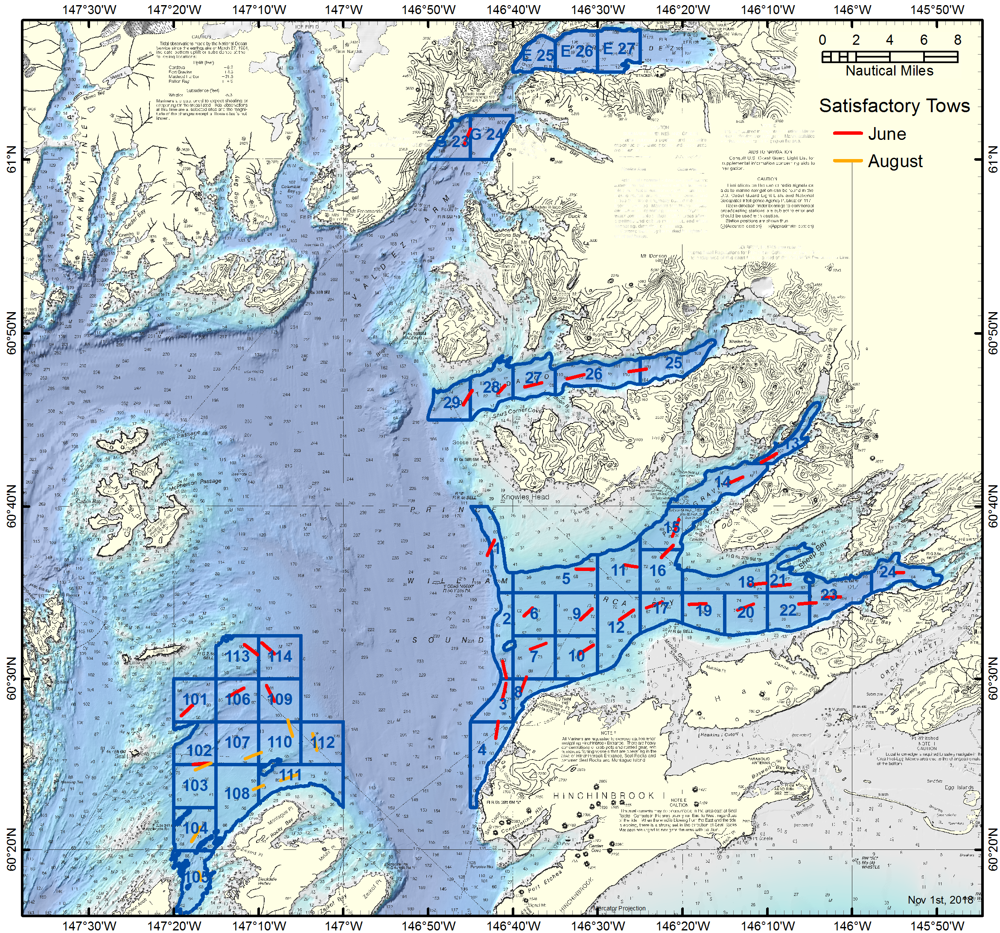

```{r, echo=FALSE, message=FALSE, warning=F}
library(knitr)
library(xtable)
library(tidyverse)
library(kableExtra)
options(scipen=9999) # remove scientific notation
knitr::opts_chunk$set(echo = FALSE, message=F, warning=F)
```

The 2018 Prince William Sound large-mesh bottom trawl survey was completed from June $13^{th}$ to June $20^{th}$, and from August $29^{th}$ to August $30^{th}$.  Extensive gear damage from hang-ups at stations 105 and G24 in June necessitated the second cruise.  A total of 44 successful 1 nmi tows were completed, with 36 of these in June and the remaining 8 in August (Figure 1).  The Tanner catch consisted of 1,064 males and 946 females.  

Although the legal carapace width was reduced from 135 mm (5.3 in) to 127 mm (5.0 in) in 2017, the historical legal size was retained for achieving minimum stock size thresholds and setting total allowable catch (5 AAC 35.308).  Catch can be retained so long as it is larger than the legal size (127 mm).  The abundance threshold for opening the commercial fishery is 200,000 males larger than the historical legal size (135 mm).

The 2018 catch included 85 males larger than the historical legal size.  Mean historically legal male CPUE in the 2018 survey was 1.98 crab/nmi (SE = 0.37; CV = 122 %) and ranged from 0 to 7.87.  The estimated abundance (± 95% CI) of historically legal males in 2018 was 75,103 ± 28,106 crab, a 50% decline from the previous year and well below the commercial threshold (Table 1, Figure 2).  This decline was unexpected given the strength of the prerecruit-1 cohort observed in the 2017 survey.  Generalizing, a declining trend is now apparent following the peak abundance of historically legal males in 2011 and 2013.  Abundance estimates are not included for Valdez Arm because only 1 tow was completed in those ancillary stations. 


\listoftables
\listoffigures



\hfill\break
\hfill\break
\hfill\break

\newpage
```{r, results='asis', echo=F}
read.csv("../output/931PopMales_Main.csv") %>% filter (YEAR > 1990) %>%
    select(Year = YEAR, Tows = n, 'Pre-4 (<73)' = P4, 'Pre-3 (73-92)' = P3,
           'Pre-2 (93-112)' = P2, 'Pre-1 (113-134)' = P1,
           'Abund. (>135)'= LM_P_, '± 95% CI'= LM_P_CI_, 'Abund.' = TM_P_, '± 95% CI '= TM_P_CI_ ) %>%
    mutate (Year = as.factor(Year)) %>%
    mutate_if(is.numeric,funs(prettyNum(., big.mark=","))) %>%
    mutate (Year = as.numeric(as.character(Year))) %>%
    add_row(Year = c(1996,1998,2000,2002,2004,2006,2008,2010,2012,2016), 'Pre-1 (113-134)' = rep('No_Survey',10)) %>%
    mutate_all(funs(replace(., is.na(.), '-'))) %>%
    arrange(Year) -> LM17

kable(LM17, format = "latex", booktabs = T, align = 'r',
      caption="Male Tanner crab abundance estimates from trawl surveys in Prince William Sound, 1991-2018. Parenthetical size limits are carapace width in millimeters.") %>%
kable_styling() %>%
add_header_above(c(" " = 2, "Pre-Recruits" = 4, "Historical Legal Males" = 2, "Total Males" = 2))%>%
column_spec(1:2, width = "1.3em") %>%
column_spec(3:5, width = "3.9em")%>%
column_spec(6, width = "4.1em")%>%
column_spec(7, width = "4.5em") %>%
column_spec(8, width = "4.3em") %>%
column_spec(9, width = "4.6em") %>%
column_spec(10, width = "4.3em")
```  

```{r, results='asis', echo=F}
read.csv("../output/931PopFems_Main.csv") %>% filter (year > 1990) %>% 
  select(Year = year, Tows = tows, 'Abund.' = FT11_P_, '± 95% CI' = FT11_P_CI_,
         'Abund. ' = MF_P_, '± 95% CI ' = MF_P_CI_,
         'Abund.  ' =TF_P_, '± 95% CI  ' = TF_P_CI_) %>%

  mutate (Year = as.factor(Year)) %>%
  mutate_if(is.numeric,funs(prettyNum(., big.mark=","))) %>%
  mutate (Year = as.numeric(as.character(Year))) %>%
  add_row(Year = c(1996,1998,2000,2002,2004,2006,2008,2010,2012,2016), 'Abund.' = rep('No_Survey',10)) %>%
  mutate_all(funs(replace(., is.na(.), '-'))) %>%
  arrange(Year) -> fem

kable(fem, format = "latex", booktabs = T, align = 'r',
      caption="Female Tanner crab abundance estimates from trawl surveys in Prince William Sound, 1991-2018.") %>%
  kable_styling() %>%
  add_header_above(c(" " = 2, "Juvenile" = 2, "Mature" = 2, "Total Females" = 2))
```
\hfill\break
\hfill\break
\hfill\break


\pagebreak
\newpage


