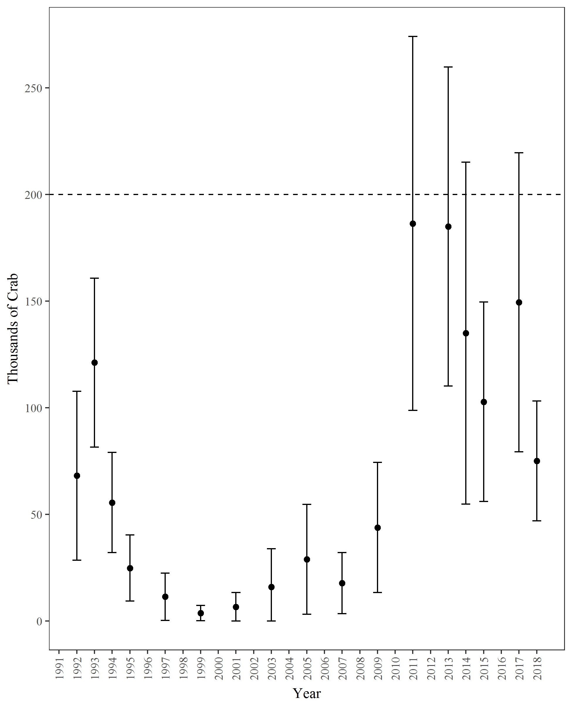

```{r, echo=FALSE, message=FALSE, warning=F}
library(knitr)
library(xtable)
library(tidyverse)
library(kableExtra)
options(scipen=9999) # remove scientific notation
knitr::opts_chunk$set(echo = FALSE, message=F, warning=F)
```

The 2018 Prince William Sound large-mesh bottom trawl survey was completed during two separate cruises from June 13th to June 20th and from August 29 to August 30th.  A total of 44 successful 1 nmi tows were completed, with 36 of these completed in June and 8 in August (Figure 1).  Only 1 tow was completed in Valdez Arm.  A total of 1,064 male and 946 female Tanner crab were captured.

Although the legal size was reduced from 135 mm (5.3 in) to 127 mm (5.0 in) in 2017, the historical legal size of 135 mm was retained for achieving minimum stock size thresholds and setting total allowable catch (5 AAC 35.308).  Catch can be retained so long as it is larger than the legal size (127 mm).  The abundance threshold for opening the commercial fishery is 200,000 males larger than the historical legal size.

The 2018 catch included 85 historical legal males.  Mean historical legal male CPUE was 1.98 crab/nmi (SE = 0.37; CV = 179%) and ranged from 0 to 7.87.  The estimated abundance of historical legal males was 75,103 crabs (+/-28,106 @ 95% CI), a 50% decline from 2017 (Table 1, Figure 2).  This decline was unexpected given the strong cohort of pre-1 crabs observed in the 2017 survey.

\listoftables
\listoffigures


\hfill\break
\hfill\break
\hfill\break

\newpage
```{r, results='asis', echo=F}
read.csv("../output/931PopMales_Main.csv") %>% filter (YEAR > 1990) %>%
    select(Year = YEAR, Tows = n, 'Pre-4 (<73)' = P4, 'Pre-3 (73-92)' = P3,
           'Pre-2 (93-112)' = P2, 'Pre-1 (113-134)' = P1,
           'Abund. (>135)'= LM_P_, '± 95% CI'= LM_P_CI_, 'Abund.' = TM_P_, '± 95% CI '= TM_P_CI_ ) %>%
    mutate (Year = as.factor(Year)) %>%
    mutate_if(is.numeric,funs(prettyNum(., big.mark=","))) %>%
    mutate (Year = as.numeric(as.character(Year))) %>%
    add_row(Year = c(1996,1998,2000,2002,2004,2006,2008,2010,2012,2016), 'Pre-1 (113-134)' = rep('No_Survey',10)) %>%
    mutate_all(funs(replace(., is.na(.), '-'))) %>%
    arrange(Year) -> LM17

kable(LM17, format = "latex", booktabs = T, align = 'r',
      caption="Male Tanner crab abundance estimates from trawl surveys in Prince William Sound, 1991-2018. Parenthetical size limits are carapace width in millimeters.") %>%
kable_styling() %>%
add_header_above(c(" " = 2, "Pre-Recruits" = 4, "Historical Legal Males" = 2, "Total Males" = 2))%>%
column_spec(1:2, width = "1.3em") %>%
column_spec(3:5, width = "3.9em")%>%
column_spec(6, width = "4.1em")%>%
column_spec(7, width = "4.5em") %>%
column_spec(8, width = "4.3em") %>%
column_spec(9, width = "4.6em") %>%
column_spec(10, width = "4.3em")
```  

```{r, results='asis', echo=F}
read.csv("../output/931PopFems_Main.csv") %>% filter (year > 1990) %>% 
  select(Year = year, Tows = tows, 'Juvenile' = FT11_P_, '± 95% CI' = FT11_P_CI_,
         'Abund.' = MF_P_, '± 95% CI ' = MF_P_CI_,
         'Abund. ' =TF_P_, '± 95% CI  ' = TF_P_CI_) %>%

  mutate (Year = as.factor(Year)) %>%
  mutate_if(is.numeric,funs(prettyNum(., big.mark=","))) %>%
  mutate (Year = as.numeric(as.character(Year))) %>%
  add_row(Year = c(1996,1998,2000,2002,2004,2006,2008,2010,2012,2016), 'Abund.' = rep('No_Survey',10)) %>%
  mutate_all(funs(replace(., is.na(.), '-'))) %>%
  arrange(Year) -> fem

kable(fem, format = "latex", booktabs = T, align = 'r',
      caption="Female Tanner crab abundance estimates from trawl surveys in Prince William Sound, 1991-2018.") %>%
  kable_styling() %>%
  add_header_above(c(" " = 2, "Juvenile" = 2, "Mature" = 2, "Total Females" = 2))
```
\hfill\break
\hfill\break
\hfill\break



\pagebreak
\newpage


